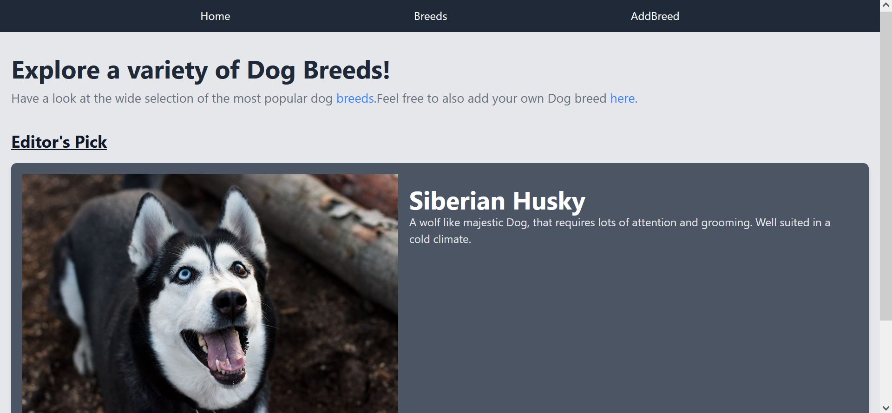

# Dog Breed Finder

#### A simple website for viewing and findnig dog breeds.

#### By **Ian Kabaka**

## Description

This is a Dog breed website finder that can offer you detailed infromation including images about that specific breed so that you can make a good decision before purchasing that dog breed.

## Screenshot



## Features

- Home page displaying the featured dog
- Individual dog breed view
- Search for available breeds
- Add breed page with a form

## How to Use

### Requirements

- A computer, tablet, or phone
- Access to the internet
- A modern web browser

### View Live Site

Visit the deployed application at: [Dog breed finder](https://dogsfinder.netlify.app)

The live site allows you to:

- Browse through the home page linking to other pages.
- Click on any image card button to view more about that particular breed.
- Navigate to the add Breed page and dd your preffered information.

### Local Development

If you want to run the project locally, you'll need:

- Node.js installed on your computer
- Basic understanding of React JS
- Code editor (VS Code recommended)
- Terminal/Command Line

#### Installation Process

1. Clone this repository using:

   ```bash
   git clone https://github.com/kabakadev/dogfinder.git
   ```

   or by downloading a ZIP file of the code.

2. Navigate to the project directory:

   ```bash
   cd dogfinder
   ```

3. Install the required dependencies:

   ```bash
   npm install
   ```

4. Run the development server:

   ```bash
   npm run start
   ```

5. Open your preffered browser and visit `http://localhost:3000`

## Technologies Used

- React JS
- Create React App
- Tailwind css
- Material UI

## Related Repositories

### Backend API

- Repository: [dog-finder-json-server](https://github.com/kabakadev/dog-finder-json-server.git)
- Deployed API: [Live API URL](https://dog-finder-json-server.onrender.com)

## Support and Contact Details

If you have any questions, suggestions, or need assistance, please contact:

- Email: <ian.kabaka@moringaschool.com>

## License

MIT License

Copyright &copy; 2024 Ian Kabaka

Permission is hereby granted, free of charge, to any person obtaining a copy of this software and associated documentation files (the "Software"), to deal in the Software without restriction, including without limitation the rights to use, copy, modify, merge, publish, distribute, sublicense, and/or sell copies of the Software, and to permit persons to whom the Software is furnished to do so, subject to the following conditions:

The above copyright notice and this permission notice shall be included in all copies or substantial portions of the Software.

THE SOFTWARE IS PROVIDED "AS IS", WITHOUT WARRANTY OF ANY KIND, EXPRESS OR IMPLIED, INCLUDING BUT NOT LIMITED TO THE WARRANTIES OF MERCHANTABILITY, FITNESS FOR A PARTICULAR PURPOSE AND NONINFRINGEMENT. IN NO EVENT SHALL THE AUTHORS OR COPYRIGHT HOLDERS BE LIABLE FOR ANY CLAIM, DAMAGES OR OTHER LIABILITY, WHETHER IN AN ACTION OF CONTRACT, TORT OR OTHERWISE, ARISING FROM, OUT OF OR IN CONNECTION WITH THE SOFTWARE OR THE USE OR OTHER DEALINGS IN THE SOFTWARE.
